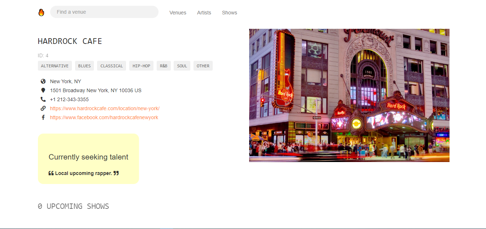

Fyyur
-----

## Description

Fyyur is a musical venue and artist booking site that facilitates the discovery and bookings of shows between local performing artists and venues. This site lets you list new artists and venues, discover them, and list shows with artists as a venue owner.



Built as a project in the [Udacity's Full Stack web developer Nanodegree](https://www.udacity.com/course/full-stack-web-developer-nanodegree--nd0044)

All backend code follows PEP8 style guidelines.

## Tech Stack (Dependencies)

### 1. Backend Dependencies
Tech stack for the backend includes the following:
 * **virtualenv** as a tool to create isolated Python environments
 * **SQLAlchemy ORM** to be our ORM library of choice
 * **PostgreSQL** as our database of choice
 * **Python3** and **Flask** as our server language and server framework
 * **Flask-Migrate** for creating and running schema migrations.
  
You can download and install the dependencies mentioned above using `pip` as:
```
pip install virtualenv
pip install SQLAlchemy
pip install postgres
pip install Flask
pip install Flask-Migrate
```
> **Note** - If we do not mention the specific version of a package, then the default latest stable package will be installed. 

### 2. Frontend Dependencies
You must have the **HTML**, **CSS**, and **Javascript** with [Bootstrap 3](https://getbootstrap.com/docs/3.4/customize/) for our website's frontend. Bootstrap can only be installed by Node Package Manager (NPM). Therefore, if not already, download and install the [Node.js](https://nodejs.org/en/download/). Windows users must run the executable as an Administrator, and restart the computer after installation. After successfully installing the Node, verify the installation as shown below.
```
node -v
npm -v
```
Install [Bootstrap 3](https://getbootstrap.com/docs/3.3/getting-started/) for the website's frontend:
```
npm init -y
npm install bootstrap@3
```


## Main Files: Project Structure

  ```sh
  ├── README.md
  ├── app.py *** the main driver of the app.
                    "python app.py" to run after installing dependencies 
  ├── models.py *** Includes your SQLAlchemy models.
  ├── config.py *** Database URLs, CSRF generation, etc
  ├── error.log
  ├── forms.py *** Your forms
  ├── requirements.txt *** The dependencies we need to install with "pip3 install -r requirements.txt"
  ├── static
  │   ├── css 
  │   ├── font
  │   ├── ico
  │   ├── img
  │   └── js
  └── templates
      ├── errors
      ├── forms
      ├── layouts
      └── pages
  ```

Overall:
* Models are located in the `models.py` file`.
* Controllers are also located in `app.py`.
* The web frontend is located in `templates/`, which builds static assets deployed to the web server at `static/`.
* Web forms for creating data are located in `form.py`


Highlight folders:
* `templates/pages` -- Defines the pages that are rendered to the site. These templates render views based on data passed into the template’s view, in the controllers defined in `app.py`. These pages successfully represent the data to the user, and are already defined for you.
* `templates/layouts` -- Defines the layout that a page can be contained in to define footer and header code for a given page.
* `templates/forms` -- Defines the forms used to create new artists, shows, and venues.
* `app.py` -- Defines routes that match the user’s URL, and controllers which handle data and renders views to the user.
* Models in `models.py` -- Defines the data models that set up the database tables.
* `config.py` -- Stores configuration variables and instructions, separate from the main application code. This is where you will need to connect to the database.


## Getting started locally
### **Download the project starter code**
Fork this repo and clone to you local
```sh
git clone https://github.com/your_username/Fyyur.git
cd Fyyur
```

### **Initialize and activate a virtualenv using:**
```
python -m virtualenv env
source env/bin/activate
```
>**Note** - In Windows, the `env` does not have a `bin` directory. Therefore, you'd use the analogous command shown below:
```
source env/Scripts/activate
```

### **Install the dependencies:**
```sh
pip install -r requirements.txt
```

### **To sync the current database, just refresh the migrations folder and run the upgrade command below.**
```sh
flask db upgrade
```

### **Run the development server:**
```
export FLASK_APP=app.py
export FLASK_DEBUG=true # enables debug mode
python3 app.py
```

### **Verify on the Browser**<br>
Navigate to project homepage [http://127.0.0.1:5000/](http://127.0.0.1:5000/) or [http://localhost:5000](http://localhost:5000) 


## Deployment N/A

## Authors
[Udacity FSND Team](https://www.udacity.com/course/full-stack-web-developer-nanodegree--nd0044) and [Sonde Omobolaji](https://github.com/omobolajisonde)

## Acknowledgements
The awesome team at Udacity and my dear instructor, [Amy Hua](https://github.com/amyhua)
